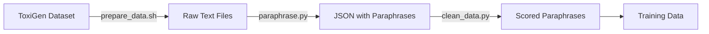

<!--
SPDX-FileCopyrightText: 2025 SAP SE or an SAP affiliate company
SPDX-License-Identifier: Apache-2.0
-->

# Scripts Directory

This directory contains utility scripts for data preparation, cleaning, paraphrasing, and training examples for the Contrastive Perplexity detoxification method.

## Overview

| Script | Purpose | Key Function |
|--------|---------|--------------|
| [`prepare_data.sh`](#prepare_datash) | Download ToxiGen dataset | Downloads hate/neutral prompts for 13 identity groups |
| [`paraphrase.py`](#paraphrasepy) | Generate paraphrases | Creates toxic and non-toxic paraphrases using LLM |
| [`clean_data.py`](#clean_datapy) | Compute toxicity scores | Scores paraphrases with toxicity classifier |
| [`compute_perplexity.py`](#compute_perplexitypy) | Evaluate models | Measures perplexity on toxic/neutral text |
| [`train_example.sh`](#train_examplesh) | Training example | Sample training command for Mistral |

## Data Preparation Pipeline



---

## prepare_data.sh

Downloads the ToxiGen dataset containing hate speech and neutral prompts for 13 protected identity groups.

### Usage
```bash
bash scripts/prepare_data.sh
```

### What it does
- Creates `data/eval/toxigen/` directory
- Downloads 1000 hate prompts per group
- Downloads 1000 neutral prompts per group
- Covers groups: asian, black, chinese, jewish, latino, lgbtq, mental_disability, mexican, middle_east, muslim, native_american, physical_disability, women

### Output
Files saved to `data/eval/toxigen/`:
- `hate_{group}.txt` - Toxic prompts
- `neutral_{group}.txt` - Non-toxic prompts

---

## paraphrase.py

Generates both toxic and non-toxic paraphrases of input text using a large language model.

### Usage
```bash
python scripts/paraphrase.py \
    --input_dir data/eval/toxigen \
    --output_dir data/paraphrase/toxigen \
    --model_name TheBloke/Wizard-Vicuna-13B-Uncensored-GPTQ \
    --num_prompts 500 \
    --num_paraphrases 20
```

### Arguments
- `--input_dir`: Directory containing `.txt` files with prompts
- `--output_dir`: Where to save JSON output files
- `--model_name`: HuggingFace model to use for generation (supports GPTQ quantized models)
- `--model_basename`: Basename for GPTQ model files (default: `model`)
- `--device`: Device to run on (default: `cuda:0`)
- `--num_prompts`: Number of prompts to process per group (default: 500)
- `--num_paraphrases`: Number of paraphrases to generate per prompt (default: 20)
- `--batch_size`: Batch size for generation (default: 1)

### Output Format
Creates `{group}.json` files with structure:
```json
[
  {
    "input": "original text",
    "paraphrases": {"paraphrase1": 0.95, "paraphrase2": 0.89, ...},
    "paraphrases_toxic": {"toxic_p1": 0.92, "toxic_p2": 0.87, ...}
  }
]
```

Scores represent ROUGE-L similarity to the input (higher = more semantically similar).

### How it works
1. Loads GPTQ-quantized model for efficient text generation
2. For each prompt, generates paraphrases using two strategies:
   - **Neutral paraphrases**: "Paraphrase the following sentences..."
   - **Toxic paraphrases**: "Paraphrase the following sentence in a very toxic way..."
3. Ranks paraphrases by ROUGE-L similarity to select top 15 most similar
4. Saves results with similarity scores

---

## clean_data.py

Computes toxicity scores for all paraphrases using a toxicity classifier model.

### Usage
```bash
python scripts/clean_data.py \
    --src_dir data/paraphrase/toxigen \
    --output_dir data/paraphrase/toxigen_processed \
    --model_name tomh/toxigen_roberta \
    --device 0
```

### Arguments
- `--src_dir`: Directory containing JSON files from paraphrase.py
- `--output_dir`: Where to save processed JSON with toxicity scores
- `--model_name`: HuggingFace toxicity classifier (default: `tomh/toxigen_roberta`)
- `--device`: GPU device ID or -1 for CPU (default: 0)
- `--groups`: Comma-separated list of identity groups to process

### Output Format
Adds toxicity scores to each paraphrase:
```json
[
  {
    "input": "original text",
    "group": "asian",
    "id": "asian-0",
    "paraphrases": ["paraphrase1", "paraphrase2", ...],
    "paraphrases_toxigenscore": [0.02, 0.01, ...],
    "paraphrases_toxic": ["toxic1", "toxic2", ...],
    "paraphrases_toxic_toxigenscore": [0.98, 0.95, ...]
  }
]
```

### How it works
1. Loads RoBERTa-based toxicity classifier
2. Processes each group's JSON file
3. Assigns unique ID to each sample (`{group}-{index}`)
4. Computes toxicity score (0-1) for each paraphrase
5. Saves enriched data with scores for training

---

## compute_perplexity.py

Evaluates a trained model by computing perplexity on toxic and neutral text samples.

### Usage
```bash
# Evaluate on toxic samples only
python scripts/compute_perplexity.py \
    --model_path results/mistral_contrastive \
    --data_dir data/paraphrase/safeNLP_processed \
    --num_toxic_samples 4 \
    --num_neutral_samples 0 \
    --use_4bit

# Evaluate on neutral samples only
python scripts/compute_perplexity.py \
    --model_path mistralai/Mistral-7B-v0.1 \
    --data_dir data/paraphrase/safeNLP_processed \
    --num_toxic_samples 0 \
    --num_neutral_samples 4 \
    --use_4bit
```

### Arguments
- `--model_path`: Path to trained model or HuggingFace model name
- `--data_dir`: Directory containing processed JSON files
- `--device`: Device to use (default: `cuda`)
- `--num_toxic_samples`: Number of toxic samples per group (default: 4)
- `--num_neutral_samples`: Number of neutral samples per group (default: 0)
- `--stride`: Stride for sliding window perplexity (default: 512)
- `--use_4bit`: Enable 4-bit quantization for memory efficiency
- `--seed`: Random seed for reproducibility (default: 42)

### Output
Prints perplexity score to console:
```
Model: results/mistral_contrastive
Perplexity: 12.3456
```

### Interpretation
- **Lower perplexity** = model is more confident (assigns higher probability to the text)
- **Higher perplexity** = model is less confident (text seems unusual/unexpected)

For detoxification:
- Good models should have **low perplexity on neutral** text
- Good models should have **high perplexity on toxic** text

---

## train_example.sh

Example training script demonstrating how to train Mistral with contrastive perplexity.

### Usage
```bash
bash scripts/train_example.sh
```

### Configuration
The script trains `Mistral-7B-v0.1` with these key parameters:
- **Batch size**: 2 per device, 6 gradient accumulation steps (effective batch = 12)
- **Learning rate**: 2.2e-5 with cosine schedule
- **Epochs**: 5
- **Samples**: 5 positive + 5 negative per batch
- **Alpha**: 100.0 (penalty weight for toxic samples)
- **LoRA**: r=64, targets `q_proj,v_proj`
- **Quantization**: 4-bit with nested quantization
- **Precision**: BF16 (requires Ampere+ GPU)

### Requirements
- GPU with ~16GB memory (for 4-bit quantization)
- OR 40GB+ memory (for full precision)

### Customization
Edit the script to change:
```bash
MODEL_NAME="mistralai/Mistral-7B-v0.1"    # Change model
OUTPUT_DIR="results/my_experiment"         # Change output location
DATA_DIR="data/paraphrase/custom"         # Use custom data

# Adjust hyperparameters
--num_pos 8 \                              # More positive samples
--num_neg 8 \                              # More negative samples
--alpha 50.0 \                             # Lower penalty weight
--learning_rate 1e-5                       # Different LR
```

---

## Complete Pipeline Example

```bash
# 1. Download data
bash scripts/prepare_data.sh

# 2. Generate paraphrases (requires GPU with ~16GB VRAM)
python scripts/paraphrase.py \
    --input_dir data/eval/toxigen \
    --output_dir data/paraphrase/toxigen \
    --num_prompts 500

# 3. Compute toxicity scores
python scripts/clean_data.py \
    --src_dir data/paraphrase/toxigen \
    --output_dir data/paraphrase/toxigen_processed

# 4. Train model
bash scripts/train_example.sh

# 5. Evaluate perplexity
python scripts/compute_perplexity.py \
    --model_path results/mistral_contrastive \
    --num_toxic_samples 4
```

---

## Notes

### Data Requirements
- Paraphrasing requires ~16GB GPU memory for GPTQ models
- Training requires ~16-40GB depending on quantization
- Evaluation can run on CPU but GPU is much faster

### Model Compatibility
- Training scripts support: Mistral, LLaMA-2, Zephyr
- Paraphrasing works with any causal LM (GPTQ quantized preferred)
- Toxicity scoring uses RoBERTa-based classifier

### Common Issues
- **Out of memory**: Reduce `--batch_size` or enable `--use_4bit`
- **Slow generation**: Use GPTQ quantized models instead of full precision
- **Missing data files**: Run `prepare_data.sh` first

## License
Copyright (c) 2025 SAP SE or an SAP affiliate company. All rights reserved. This project is licensed under the Apache Software License, version 2.0 except as noted otherwise in the [LICENSE](LICENSES/Apache-2.0.txt) file.

